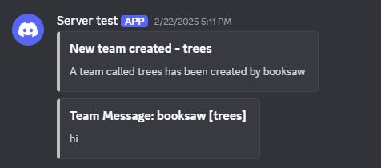
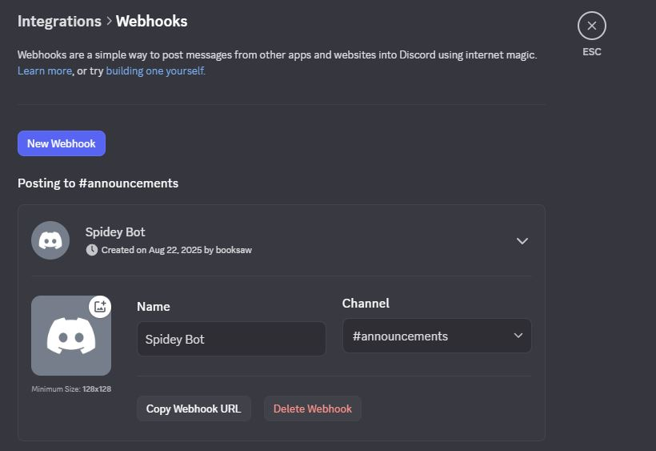

# Discord Integration

BetterTeams supports integration with discord via webhooks. When players perform teams commands, such as sending
messages to team chat. These can be forwarded on to a discord channel.

An example usage is so admins can monitor team chat messages without needing to be in the server. Or announcing to the
discord when a new Team has been created!



## Creating a webhook on Discord

To create a webhook open your **Server Settings** and on the **Integrations** tab use the **Create Webhook** buttom to
create a new webhook. From this screen, you can configure the name, profile picture and destination channel of the
webhook, then simply copy the url into your config.yml, see the [Configuration section](#configuration) for more
information on the config.yml.



For futher information, Discord provides a support article
which [describes how to create a webhook](https://support.discord.com/hc/en-us/articles/228383668-Intro-to-Webhooks)

## Configuration

The webhook integration can be configured in the config.yml file, it is located near the bottom. The relevant exert of
the config is shown below:

```yaml 
# The webhook URL of your webhook.
hookURL: "WEBHOOKURL_HERE"

# Will this feature be enabled?
# If set to false skip the rest of the settings
hookSupport: false

# If you disabled support for webhooks these settings won't matter
# You can change for what specific events the webhook should be triggered.
# For example, if you set the create-hook option to true the webhook will send a message
# on team creation.
create-hook: false
disband-hook: false
player-left-hook: false
team-nameChange-hook: false
team-chat: false
```